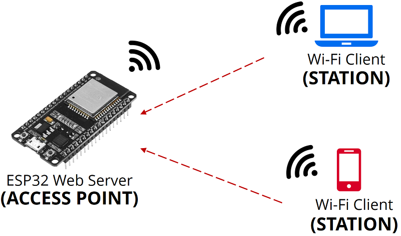

# ESP32

## ESP32 as Client

## ESP32 as Server

ESP32 menjadi Access Point, apa maksudnya?

Teman-teman disini pasti pernah mengkoneksikan smartphone nya ke Wi-Fi. Wi-Fi yang teman-teman akeses adalah **Access Point**.

Jadi, kita akan menjadikan ESP32 menjadi Wi-Fi yang dapat teman-teman access
